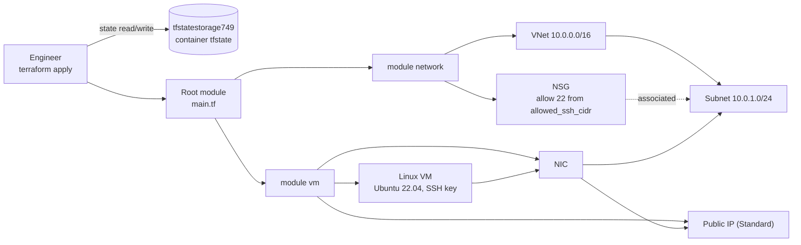

# terraform-network-backend

Project: 3.1
Modular Infrastructure (Network + VM) + Remote State in Azure Storage

## Goal

Split a small Azure setup into two reusable modules and keep the state in Azure Storage:

- `modules/network`: VNet, subnet, NSG with one SSH rule, NSG-to-subnet association
- `modules/vm`: public IP, NIC and an Ubuntu 22.04 Linux VM with SSH key login
- `backend.tf`: remote state in the `tfstate` container of `tfstatestorage749`
- `storage-import.tf`: the state storage account itself, imported into Terraform

## Architecture



## Prerequisites

- Terraform 1.5+ or OpenTofu 1.6+
- Azure CLI, logged in (`az login`)
- An existing resource group `test-rg`
- The state storage account `tfstatestorage749` with a container `tfstate` in `test-rg`
- An SSH key pair (for example `~/.ssh/id_rsa.pub`)

## Files

| File | What it does |
| --- | --- |
| `providers.tf` | azurerm `~> 4.0`. Subscription comes from `var.subscription_id` or `ARM_SUBSCRIPTION_ID` |
| `backend.tf` | azurerm backend, key `modular-infra/terraform.tfstate` |
| `main.tf` | Reads the resource group and calls the two modules |
| `variables.tf` | Names, `allowed_ssh_cidr`, `ssh_public_key` |
| `terraform.tfvars` | Names for `test-rg`, `testVNet`, `testSubnet`, `testVM` (no secrets) |
| `storage-import.tf` | The imported state storage account, with `prevent_destroy` |
| `modules/network/` | VNet, subnet, NSG, SSH rule |
| `modules/vm/` | Public IP, NIC, VM. Outputs `vm_id` and `public_ip_address` |

## Usage

```bash
az login
export ARM_SUBSCRIPTION_ID=$(az account show --query id -o tsv)

# Only your own IP may reach port 22
export TF_VAR_allowed_ssh_cidr="$(curl -s https://ifconfig.me)/32"
export TF_VAR_ssh_public_key="$(cat ~/.ssh/id_rsa.pub)"

terraform init
terraform plan -out tfplan
terraform apply tfplan
```

The state storage account was created by hand and imported once:

```bash
terraform import azurerm_storage_account.existing \
  /subscriptions/<subscription-id>/resourceGroups/test-rg/providers/Microsoft.Storage/storageAccounts/tfstatestorage749
```

## How to verify

```bash
az vm show -g test-rg -n testVM --query provisioningState -o tsv
az network nsg rule list -g test-rg --nsg-name testVNet-nsg -o table
az storage blob list --account-name tfstatestorage749 -c tfstate --auth-mode login -o table
ssh azureuser@<public ip of testVM-pip>
```

## Clean up

`prevent_destroy` on the state storage account makes a plain `terraform destroy` fail on purpose. Destroy only the modules:

```bash
terraform destroy -target=module.vm -target=module.network
```

## Troubleshooting

| Symptom | Fix |
| --- | --- |
| `Invalid value for "path" parameter: no file exists at "~/.ssh/id_rsa.pub"` | Old version of this project used `file()`. Pass the key content with `TF_VAR_ssh_public_key`. |
| `subscription ID could not be determined` | `export ARM_SUBSCRIPTION_ID=...` or set `subscription_id` in a tfvars file. |
| `Instance cannot be destroyed` for `azurerm_storage_account.existing` | Expected. Use the targeted destroy above. |
| SSH times out | `allowed_ssh_cidr` does not match your current public IP. |

## Tested

| Command | Result |
| --- | --- |
| `tofu fmt -check -recursive` | OK (after formatting the files) |
| `tofu init -backend=false` | OK, azurerm v4.81.0 |
| `tofu validate` | `Success! The configuration is valid.` |

Before the fix, `tofu validate` failed with `no file exists at "~/.ssh/id_rsa.pub"`.

NOT tested: no `plan` or `apply` (needs an Azure subscription and the state storage account). SSH login was not tested.

## Interview talking points

- **Modules with small interfaces.** The network module only exposes `subnet_id` and `nsg_id`. The VM module does not need to know how the network is built.
- **Remote state and its storage.** State lives in Azure Storage with blob lease locking. The storage account is imported and protected with `prevent_destroy`, so a `destroy` cannot delete the state it is writing to. Many teams keep the state account in a separate bootstrap stack instead.
- **No machine-specific paths in code.** `file("~/.ssh/...")` made `validate` fail on any machine without that file, such as a CI runner. Passing the key as a variable works everywhere.
- **Least-privilege network.** SSH is limited to one CIDR. For production, use Azure Bastion or just-in-time access and remove the public IP.
