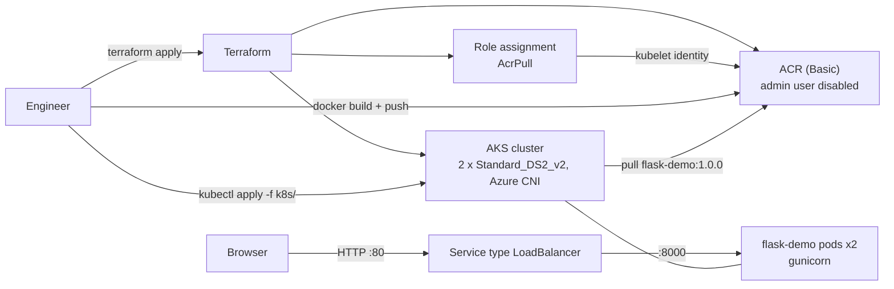

# Project 11: Deploy a containerized Flask app to AKS with Terraform

Focus: Terraform + AKS + Docker integration.
Goal: Deploy an app to a Kubernetes cluster provisioned via Terraform.

Steps: Use Terraform to create AKS + ACR. Build and push the Docker image to ACR. Apply the Kubernetes manifests (`k8s/deployment.yaml`, `k8s/service.yaml`).

Skills: Terraform AKS resources, kubectl, ACR authentication. Bonus: a LoadBalancer service for external access.

## Architecture



## Prerequisites

- Terraform 1.5+ or OpenTofu 1.6+
- Azure CLI, `kubectl`, Docker
- An existing resource group `test-rg`
- Permission to create role assignments (Owner or User Access Administrator), because of the `AcrPull` assignment

This project has no `backend.tf`, so the state is local (`terraform.tfstate`, git-ignored).

## Files

| File | What it does |
| --- | --- |
| `providers.tf` | azurerm `~> 4.0`. Subscription from `var.subscription_id` or `ARM_SUBSCRIPTION_ID` |
| `variables.tf` | ACR name, cluster name, DNS prefix, node count and size |
| `main.tf` | ACR, AKS (system-assigned identity), `AcrPull` for the kubelet identity |
| `outputs.tf` | ACR login server, cluster name, resource group |
| `app/app.py` | Flask app with `/` and `/healthz` |
| `app/Dockerfile` | `python:3.12-slim`, gunicorn on port 8000, runs as UID 10001 |
| `k8s/deployment.yaml` | 2 replicas, probes, requests/limits, non-root, read-only root filesystem |
| `k8s/service.yaml` | `LoadBalancer` on port 80 to container port 8000 |

## Usage

1. Create ACR and AKS.

   ```bash
   az login
   export ARM_SUBSCRIPTION_ID=$(az account show --query id -o tsv)
   terraform init
   terraform apply
   ```

2. Build and push the image. `az acr build` builds in Azure, so you do not need a local Docker daemon.

   ```bash
   ACR=$(terraform output -raw acr)
   az acr build --registry "${ACR%%.*}" --image flask-demo:1.0.0 app/
   # or locally:
   # az acr login --name "${ACR%%.*}"
   # docker build -t "$ACR/flask-demo:1.0.0" app/ && docker push "$ACR/flask-demo:1.0.0"
   ```

3. Deploy to AKS. If you changed the ACR name, update `image:` in `k8s/deployment.yaml` first.

   ```bash
   az aks get-credentials -g test-rg -n "$(terraform output -raw aks_cluster_name)"
   kubectl apply -f k8s/
   ```

## How to verify

```bash
kubectl get nodes
kubectl rollout status deployment/flask-demo
kubectl get service flask-demo   # wait for EXTERNAL-IP
curl http://<EXTERNAL-IP>/
curl http://<EXTERNAL-IP>/healthz
```

Run the app locally without Docker:

```bash
cd app
python3 -m venv .venv && . .venv/bin/activate
pip install -r requirements.txt
python app.py   # http://localhost:8000/
```

## Clean up

```bash
kubectl delete -f k8s/
terraform destroy
```

## Troubleshooting

| Symptom | Fix |
| --- | --- |
| Pods in `ImagePullBackOff` with `401 Unauthorized` | The `AcrPull` assignment is missing or still propagating. Check with `az aks check-acr -g test-rg -n testakscluster --acr <acr>.azurecr.io`. |
| `The registry name is already in use` | ACR names are global. Change `var.acr` and the image in `k8s/deployment.yaml`. |
| `AuthorizationFailed` on `azurerm_role_assignment` | Your identity cannot create role assignments. You need Owner or User Access Administrator on the ACR scope. |
| Service `EXTERNAL-IP` stays `<pending>` | Wait a few minutes. Check `kubectl describe service flask-demo` for load balancer events. |

## Tested

| Command | Result |
| --- | --- |
| `tofu fmt -check -recursive` | OK (after formatting the files) |
| `tofu init -backend=false` and `tofu validate` | `Success! The configuration is valid.` |
| `python3 -m py_compile app/app.py` | OK |
| Flask test client against `/` and `/healthz` | Both `200` |
| `kubeconform -strict -summary k8s/` | `Valid: 2, Invalid: 0` |

NOT tested: no AKS or ACR was created (needs an Azure subscription). The Docker image was not built in this review, and the manifests were not applied to a cluster.

## Interview talking points

- **Managed identity instead of ACR admin credentials.** `admin_enabled = false`. The kubelet identity gets `AcrPull` on the registry, so there are no registry passwords or image pull secrets.
- **Role assignment timing.** A new kubelet identity can take time to appear in Entra ID. `skip_service_principal_aad_check = true` avoids a flaky first apply.
- **Azure CNI with a standard load balancer.** Pods get VNet IPs, which helps with network policies and private access, but uses more IP space than kubenet or CNI Overlay.
- **Pod hardening.** Non-root UID, read-only root filesystem, dropped capabilities, probes and resource limits. Without limits, one pod can starve a node.
- **What to add next.** A pinned `kubernetes_version`, the cluster autoscaler, a separate user node pool, and remote state.
