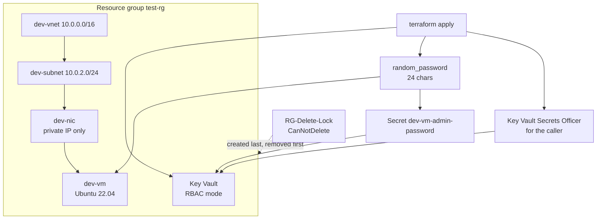

# Project 3: Variable types, resource group lock and a generated VM password

## Goal

- Practice Terraform variable types: `string`, `number`, `bool`, `list`, `map`, `tuple` and `object`
- Protect the resource group with a `CanNotDelete` management lock, and still be able to `destroy`
- Create a Linux VM without a password in the code: the password is generated with `random_password` and stored in Azure Key Vault

## Architecture



## Variable types used

| Variable | Type | Used for |
| --- | --- | --- |
| `environment` | `string` | Name prefix (`dev-vnet`, `dev-vm`, ...) |
| `storage_disk` | `number` | OS disk size in GB |
| `is_delete` | `bool` | `delete_os_disk_on_termination` |
| `allowed_locations` | `list(string)` | Precondition: the resource group must be in one of these regions |
| `allowed_vm_sizes` | `list(string)` | Precondition: `vm_config.size` must be in this list |
| `resource_tags` | `map(string)` | Tags on the VM and Key Vault |
| `network_config` | `tuple([string, string, number])` | VNet CIDR, subnet address, subnet prefix length |
| `vm_config` | `object({...})` | VM size and image |

## Prerequisites

- Terraform 1.5+ or OpenTofu 1.6+ (`terraform test` / `tofu test` needs Terraform 1.7+ or OpenTofu 1.8+)
- Azure CLI, logged in
- Existing resource group `test-rg` and state storage `tfstatestorage759` / container `tfstate`
- Owner or User Access Administrator on `test-rg` (for the lock and the Key Vault role assignment)

## Files

| File | What it does |
| --- | --- |
| `providers.tf` | azurerm `~> 4.0` and random `~> 3.6` |
| `backend.tf` | azurerm backend, key `project3/terraform.tfstate` |
| `variables.tf` | All variable types listed above, plus `admin_username` |
| `main.tf` | VNet, subnet, NIC, VM, Key Vault, secret, role assignment, lock |
| `outputs.tf` | VM name, private IP, Key Vault and secret name, `admin_password` (sensitive) |
| `tests/password.tftest.hcl` | Offline test with a mocked azurerm provider |

## Usage

```bash
az login
export ARM_SUBSCRIPTION_ID=$(az account show --query id -o tsv)
terraform init
terraform plan
terraform apply
```

If you applied this project before the state key changed (it was `modular-infra/terraform.tfstate`), move the state once:

```bash
terraform init -migrate-state
```

Read the generated password:

```bash
# From Key Vault (needs Key Vault Secrets User or Officer on the vault)
az keyvault secret show --vault-name "$(terraform output -raw key_vault_name)" \
  --name "$(terraform output -raw admin_password_secret_name)" --query value -o tsv

# Or from state (the output is sensitive, so it is hidden in plan/apply)
terraform output -raw admin_password
```

## How to verify

```bash
az lock list -g test-rg -o table
az vm show -g test-rg -n dev-vm --query provisioningState -o tsv
az keyvault secret list --vault-name "$(terraform output -raw key_vault_name)" -o table
```

## Clean up

```bash
terraform destroy
```

The lock `depends_on` every other resource, so Terraform removes the lock first and then the rest. The Key Vault has `purge_protection_enabled = false`, so the provider can purge it on destroy.

## Error that was solved

Error:

```text
azurerm_management_lock.rg_lock: Destruction complete after 2m8s
╷
│ Error: deleting Virtual Machine (Subscription: "<subscription-id>"
│ Resource Group Name: "test-rg"
│ Virtual Machine Name: "dev-vm"): performing Delete: unexpected status 409 (409 Conflict) with error: ScopeLocked: The scope '/subscriptions/<subscription-id>/resourceGroups/test-rg/providers/Microsoft.Compute/virtualMachines/dev-vm' cannot perform delete operation because following scope(s) are locked: '/subscriptions/<subscription-id>/resourceGroups/test-rg'. Please remove the lock and try again.
│
│
╵
Releasing state lock. This may take a few moments...
```

Solution: add `depends_on` to the lock, so the lock is created after the resources and destroyed before them.

```hcl
resource "azurerm_management_lock" "rg_lock" {
  name       = "RG-Delete-Lock"
  scope      = data.azurerm_resource_group.existing_rg.id
  lock_level = "CanNotDelete"
  notes      = "This resource group is protected from deletion."

  depends_on = [
    azurerm_virtual_machine.vm,
    azurerm_virtual_network.vnet,
    azurerm_subnet.subnet,
    azurerm_network_interface.nic,
    # ... and the Key Vault resources
  ]
}
```

```bash
terraform init
terraform plan
terraform destroy
```

## Troubleshooting

| Symptom | Fix |
| --- | --- |
| `ScopeLocked` / `409 Conflict` on destroy | The lock was not removed first. Check that `depends_on` lists the resource, or remove the lock with `az lock delete`. |
| `403 Forbidden` when creating the Key Vault secret | The `Key Vault Secrets Officer` role is still propagating. Wait a minute and run `terraform apply` again. |
| `VaultAlreadyExists` / name taken | Key Vault names are global. The random suffix changes if you taint `random_string.kv_suffix`. |
| `Resource precondition failed` | `vm_config.size` is not in `allowed_vm_sizes`, or the resource group is not in `allowed_locations`. |

## Tested

| Command | Result |
| --- | --- |
| `tofu fmt -check -recursive` | OK (after formatting the files) |
| `tofu init -backend=false` and `tofu validate` | `Success! The configuration is valid.` |
| `tofu test` (mocked azurerm, real random provider) | `Success! 2 passed, 0 failed.` |

The test checks that the password is 24 characters, is not the old hardcoded value, is the value written to Key Vault, that Key Vault uses RBAC, and that a VM size outside `allowed_vm_sizes` fails the precondition.

NOT tested: no deploy to Azure (needs a subscription). The lock and destroy order were not re-checked after the Key Vault change.

## Interview talking points

- **No secrets in code.** The old version had `admin_password = "P@ssw0rd1234!"` in `main.tf`. Now `random_password` creates it and Key Vault stores it. People read it from Key Vault with their own RBAC role.
- **The password is still in state.** `random_password` and the VM resource both keep the value in state (marked sensitive). That is why the state backend must be private, encrypted and access controlled. For a stricter setup use SSH keys only, or ephemeral resources and write-only arguments such as `value_wo` on the secret.
- **Locks and Terraform.** A `CanNotDelete` lock protects against manual deletes. `depends_on` on the lock controls the order so Terraform can still destroy its own resources.
- **Key Vault RBAC instead of access policies.** Access is a normal Azure role assignment, so it shows up in the same audits and can be managed with the same tools.
- **Legacy VM resource.** This project keeps `azurerm_virtual_machine` to show the old `os_profile` blocks. New code should use `azurerm_linux_virtual_machine` (see project1).
