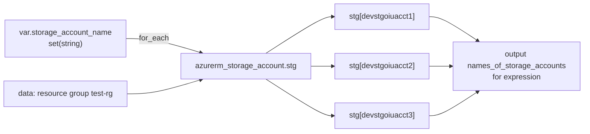

# Terraform Resource meta arguments

## Goal

Create several storage accounts from one resource block and compare `count`, `for_each` and `for` expressions.

## Architecture



## Notes

count — simple, indexed iteration

- count is used when you want multiple copies of the same resource, based on a number.
- count expects a number (`count = 2` or `count = length(list)`).
- `count.index` is the zero-based index (0, 1, 2...).
- Best suited for lists (e.g., `["sa1", "sa2", "sa3"]`).

for_each — flexible, key-value iteration

- for_each allows you to iterate over maps or sets, and gives each resource a unique key.
- for_each can iterate over a map or set of strings.
- Each instance is uniquely identified by `each.key` (if map) or `each.value` (if set).
- Terraform creates separate resources with stable keys.

for expression — used in outputs or variables

- for is not for creating multiple resources, but for transforming data (like list comprehensions in Python).

Outputs:

```text
names_of_storage_accounts = [
  "devstgoiuacct1",
  "devstgoiuacct2",
  "devstgoiuacct3",
]
```

Why `for_each` here: with `count` and a list, removing the first name shifts every index, and Terraform wants to replace the other accounts. With `for_each` each account is keyed by its name, so only the removed one is destroyed.

## Prerequisites

- Terraform 1.5+ or OpenTofu 1.6+, Azure CLI logged in
- Existing resource group `test-rg` and state storage `tfstatestorage759` / container `tfstate`

## Files

| File | What it does |
| --- | --- |
| `providers.tf` | azurerm `~> 4.0`. Subscription from `var.subscription_id` or `ARM_SUBSCRIPTION_ID` |
| `backend.tf` | azurerm backend, key `project4/terraform.tfstate` |
| `variables.tf` | `storage_account_name` set with name validation |
| `main.tf` | Storage accounts with `for_each` (TLS 1.2, no public blob access) |
| `outputs.tf` | `names_of_storage_accounts` |

## Usage

```bash
az login
export ARM_SUBSCRIPTION_ID=$(az account show --query id -o tsv)
terraform init            # add -migrate-state if you applied with the old key terraform.tfstate
terraform plan
terraform apply
```

Storage account names are global. Change the defaults if they are taken:

```bash
terraform apply -var 'storage_account_name=["mystg001","mystg002"]'
```

## How to verify

```bash
terraform output names_of_storage_accounts
terraform state list
az storage account list -g test-rg --query "[].name" -o tsv
```

## Clean up

```bash
terraform destroy
```

## Troubleshooting

| Symptom | Fix |
| --- | --- |
| `StorageAccountAlreadyTaken` | Pick other names. They must be unique across all of Azure. |
| Plan wants to destroy resources of another project | Old shared state key. Every project now has its own key; run `terraform init -migrate-state`. |
| `Invalid value for variable` | Names must be 3-24 lowercase letters and digits. |

## Tested

| Command | Result |
| --- | --- |
| `tofu fmt -check -recursive` | OK (after formatting the files) |
| `tofu init -backend=false` and `tofu validate` | `Success! The configuration is valid.` |

NOT tested: no deploy to Azure (needs a subscription). The output above is from an earlier apply by the owner.

## Interview talking points

- **`for_each` over `count` for named things.** Stable keys mean adding or removing one item does not touch the others.
- **Sets vs maps.** A set gives you `each.value` only. A map lets you pass more settings per instance, such as tier or replication.
- **Separate state per project.** This project used to share the `terraform.tfstate` key with projects 5-7 in the same container. Each `apply` would have planned to destroy the others' resources. Now every project has its own key.
- **Secure defaults.** `min_tls_version = "TLS1_2"` and `allow_nested_items_to_be_public = false` cost nothing and pass most policy checks.
