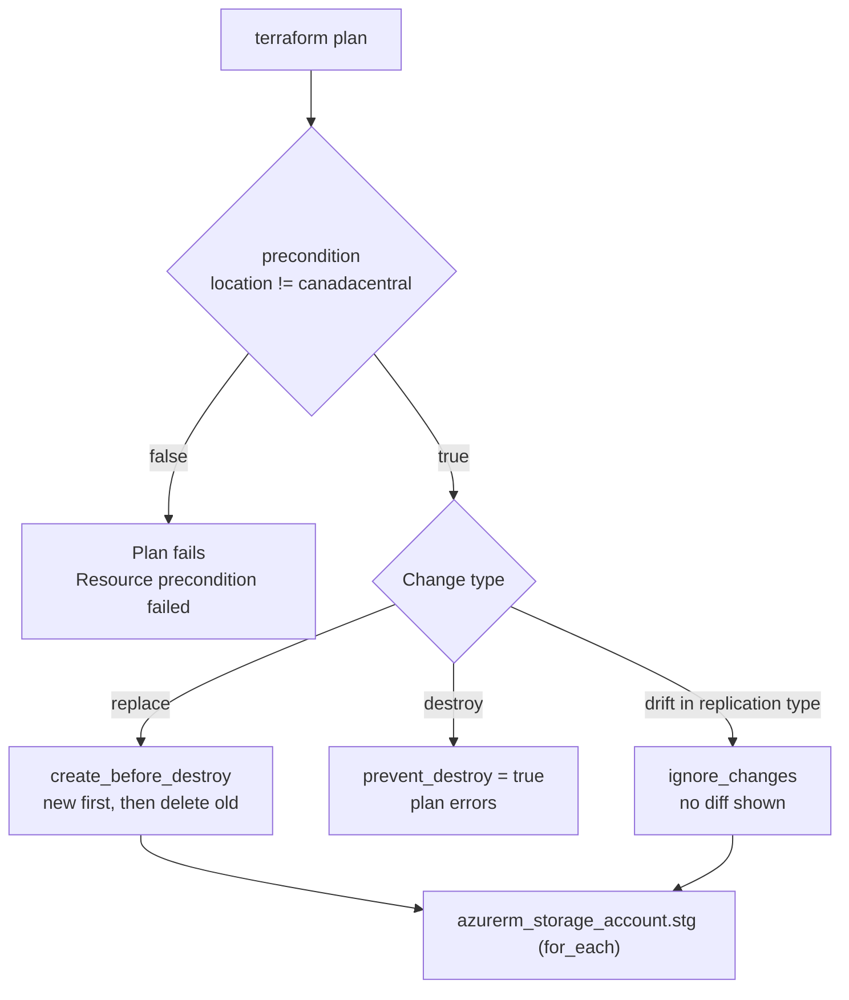

# lifecycle arguments

`create_before_destroy`, `prevent_destroy`, `ignore_changes`, and `precondition`

## Goal

Show how the `lifecycle` block changes what Terraform does on replace, destroy and drift, and how a `precondition` stops a bad plan early.

## Architecture



## create_before_destroy

```hcl
default = ["devstgoiusacct1", "devstgoiuascct2"]

lifecycle {
  create_before_destroy = false
}
```

init, plan, apply

later

```hcl
default = ["devstgoiusacct3", "devstgoiuascct4"]

lifecycle {
  create_before_destroy = true
}
```

init, plan, apply

Result: This ensures Terraform creates the new resource first before destroying the old one — useful when renaming or changing immutable fields.

## prevent_destroy

When you enable this flag, Terraform refuses to delete the resource, even if you remove or rename it.

```hcl
lifecycle {
  prevent_destroy = true
}
```

init, plan

```text
Error: Instance cannot be destroyed
│
│   on main.tf line 8:
│    8: resource "azurerm_storage_account" "stg" {
│
│ Resource azurerm_storage_account.stg["devstgoiuascct4"] has lifecycle.prevent_destroy set, but the plan calls for
│ this resource to be destroyed. To avoid this error and continue with the plan, either disable
│ lifecycle.prevent_destroy or reduce the scope of the plan using the -target option.
╵
╷
│ Error: Instance cannot be destroyed
│
│   on main.tf line 8:
│    8: resource "azurerm_storage_account" "stg" {
│
│ Resource azurerm_storage_account.stg["devstgoiusacct3"] has lifecycle.prevent_destroy set, but the plan calls for
│ this resource to be destroyed. To avoid this error and continue with the plan, either disable
│ lifecycle.prevent_destroy or reduce the scope of the plan using the -target option.
```

## ignore_changes

This tells Terraform to ignore certain attributes during future plan or apply runs — useful when attributes are changed manually outside Terraform.

```hcl
lifecycle {
  ignore_changes = [account_replication_type]
}
```

The code ignores `account_replication_type`. Change it in the portal (for example GRS to LRS), then:

```bash
terraform plan
```

Observe: Terraform will not detect or plan to revert that manual change.
This is helpful for fields like tags, timeouts, or external integrations managed by other tools.

## precondition

```hcl
precondition {
  condition     = lower(replace(var.location, " ", "")) != "canadacentral"
  error_message = "Storage account creation is not allowed in Canada Central region!"
}
```

The storage accounts are created in `var.location`, so the check protects the real region. Run with the blocked region:

```bash
terraform plan -var location=canadacentral
```

```text
Error: Resource precondition failed
│
│   on main.tf line 21, in resource "azurerm_storage_account" "stg":
│   21:       condition     = lower(var.location) != "canadacentral"
│     ├────────────────
│     │ var.location is "canadacentral"
│
│ Storage account creation is not allowed in Canada Central region!
```

(The error above was captured with the earlier version of the condition, before it also removed spaces.)

## Prerequisites

- Terraform 1.5+ or OpenTofu 1.6+, Azure CLI logged in
- Existing resource group `test-rg` and state storage `tfstatestorage759` / container `tfstate`

## Files

| File | What it does |
| --- | --- |
| `providers.tf` | azurerm `~> 4.0` |
| `backend.tf` | azurerm backend, key `project5/terraform.tfstate` |
| `variables.tf` | `location` (default `centralindia`), `storage_account_name` set |
| `main.tf` | Storage accounts with the `lifecycle` block |
| `outputs.tf` | `names_of_storage_accounts` |

## Usage

```bash
az login
export ARM_SUBSCRIPTION_ID=$(az account show --query id -o tsv)
terraform init            # add -migrate-state if you applied with the old key terraform.tfstate
terraform plan
terraform apply
```

## How to verify

```bash
terraform output names_of_storage_accounts
terraform plan -var location=canadacentral   # must fail with the precondition
```

## Clean up

Set `prevent_destroy = false` first, then:

```bash
terraform destroy
```

## Troubleshooting

| Symptom | Fix |
| --- | --- |
| `Instance cannot be destroyed` | `prevent_destroy = true` is set. Set it to `false` or use `-target` for other resources. |
| `Resource precondition failed` with the default settings | Old default was `location = "canadacentral"`. The default is now `centralindia`. |
| `StorageAccountAlreadyTaken` | Storage names are global. Change `storage_account_name`. |

## Tested

| Command | Result |
| --- | --- |
| `tofu fmt -check -recursive` | OK (after formatting the files) |
| `tofu init -backend=false` and `tofu validate` | `Success! The configuration is valid.` |

NOT tested: no deploy to Azure, and the precondition was not run in this review (a plan needs the resource group data source, so it needs a subscription). The error outputs above are from the owner's earlier runs.

## Interview talking points

- **`create_before_destroy` for zero downtime replaces**, but only when names can differ. Storage account names are global, so the new and old account cannot share a name.
- **`prevent_destroy` is a guard rail, not a lock.** It lives in code, so removing the line removes the guard. Use Azure locks or policies for real protection (see project3).
- **`ignore_changes` hides drift on purpose.** Good for fields owned by another system (tags from a policy, autoscaler counts). Bad if it hides changes you should review.
- **Preconditions must check the value actually used.** The first version checked `var.location` while the accounts used the resource group location, so the check could pass while the accounts still went to Canada Central. Now both use `var.location`.
