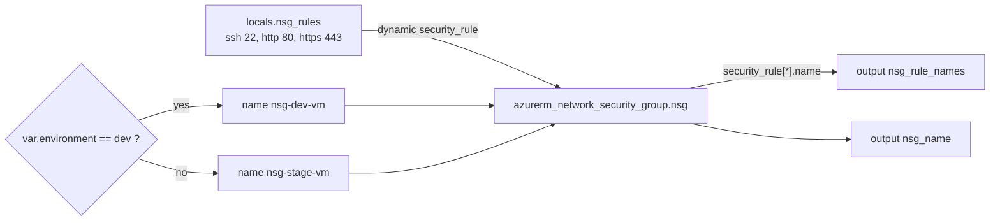

# Terraform expressions

## Goal

Use three kinds of expressions on one Network Security Group: a `dynamic` block fed by local values, a conditional expression for the name, and a splat expression in the outputs.

## Architecture



## Assignment

1. Dynamic Expressions with Local Values

   Create a local value block that defines NSG rules with the following properties:

   - One rule for SSH (port 22)
   - One rule for HTTP (port 80)
   - One rule for HTTPS (port 443)

   Each rule should include:

   - Priority
   - Direction (Inbound)
   - Access (Allow)
   - Protocol (Tcp)
   - Source port ranges (`*`)
   - Destination port ranges (respective ports)
   - Source address prefix (`*`)
   - Destination address prefix (`*`)

   Use these local values to create the Network Security Group rules for a VM.

2. Conditional Expressions

   Create a Network Security Group with a dynamic name based on environment. Requirements:

   - If `var.environment` is `"dev"`, NSG name should be `"nsg-dev-vm"`
   - For any other environment value, NSG name should be `"nsg-stage-vm"`
   - Use a conditional expression to implement this logic

3. Splat Expression

   Create outputs that show all NSG rule names using a splat expression.

The source address prefix is `var.allowed_source_address_prefix` (default `"*"` as the assignment asks). For a real VM set it to your IP or a VNet range.

## Prerequisites

- Terraform 1.5+ or OpenTofu 1.6+, Azure CLI logged in
- Existing resource group `test-rg` and state storage `tfstatestorage759` / container `tfstate`

## Files

| File | What it does |
| --- | --- |
| `locals.tf` | The three rules (priority, port, description) |
| `main.tf` | NSG with a conditional name and a `dynamic "security_rule"` block |
| `outputs.tf` | `nsg_rule_names` (splat) and `nsg_name` |
| `variables.tf` | `environment`, `allowed_source_address_prefix` |
| `backend.tf` | azurerm backend, key `project6/terraform.tfstate` |

## Usage

```bash
az login
export ARM_SUBSCRIPTION_ID=$(az account show --query id -o tsv)
terraform init            # add -migrate-state if you applied with the old key terraform.tfstate
terraform apply
terraform apply -var environment=stage   # NSG is renamed (replaced) to nsg-stage-vm
```

## How to verify

```bash
terraform output nsg_name
terraform output nsg_rule_names
az network nsg rule list -g test-rg --nsg-name nsg-dev-vm -o table
```

## Clean up

```bash
terraform destroy
```

## Troubleshooting

| Symptom | Fix |
| --- | --- |
| Plan replaces the NSG | The name changed (environment, or the fix from `dev-nsg` to `nsg-dev-vm`). An NSG name cannot be updated in place. |
| `SecurityRuleConflict` / duplicate priority | Each rule in `locals.tf` needs a unique priority. |

## Tested

| Command | Result |
| --- | --- |
| `tofu fmt -check -recursive` | OK (after formatting the files) |
| `tofu init -backend=false` and `tofu validate` | `Success! The configuration is valid.` |

NOT tested: no deploy to Azure (needs a subscription).

## Interview talking points

- **Data in locals, logic in one block.** Adding a rule is one more map entry, not a new resource.
- **Inline rules vs `azurerm_network_security_rule`.** Inline `security_rule` blocks make the NSG authoritative: rules added by hand are removed on the next apply. Separate rule resources let other stacks add rules, but you must not mix both styles on one NSG.
- **Map keys as names.** `for_each` over a map gives stable rule names (`allow_ssh`, ...), so reordering does not cause churn.
- **Open ports.** `"*"` as source is fine for a lab NSG with no VM. For real workloads, never open 22 to the internet; use Bastion or a narrow CIDR.
