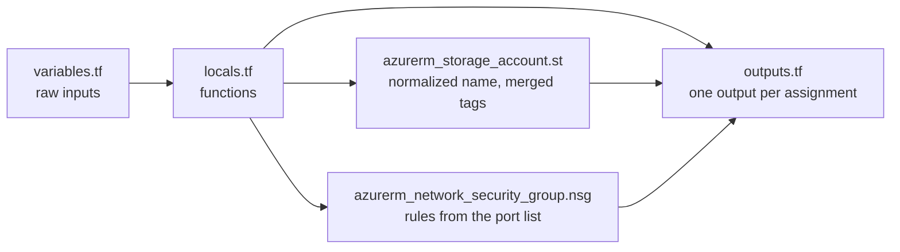

# Terraform Functions Learning Guide - Assignments

## Goal

Practice the built-in Terraform functions with small, real tasks. Most of the logic lives in `locals.tf` and is shown through outputs. Two resources (a storage account and an NSG) use the results.

## Architecture



## Status of the assignments

| # | Assignment | Where | Status |
| --- | --- | --- | --- |
| 1 | Naming (`lower`, `replace`) | `local.formatted_name` | Done (output only, no resource group is created) |
| 2 | Tags (`merge`) | `local.merged_tags` | Done, applied to the storage account |
| 3 | Storage name (`substr`) | `local.storage_normalized` | Done, with a precondition on the length |
| 4 | Ports (`split`, `join`) | `local.ports_joined` | Done, with variable validation |
| 5 | Lookup (`lookup`) | `local.env_config` | Done |
| 6 | VM size (`length`, `contains`) | `var.vm_size` validation | Done (uses `regex` for the "standard" check) |
| 7 | Backup (`endswith`, `sensitive`) | `var.backup_name`, `var.credential` | Done |
| 8 | File paths (`fileexists`, `dirname`) | `local.file_status` | Done (the `configs/` files do not exist, so `exists = false`) |
| 9 | Locations (`toset`, `concat`) | `local.unique_locations` | Done |
| 10 | Costs (`abs`, `max`) | `local.positive_costs` and friends | Done |
| 11 | Timestamps (`timestamp`, `formatdate`) | `local.name_date`, `local.tag_date` | Done |
| 12 | File content (`file`, `sensitive`) | - | Not done yet |

## Console Commands

Practice these fundamental commands in `terraform console` before starting the assignments:

```hcl
# Basic String Manipulation
lower("HELLO WORLD")
max(5, 12, 9)
trim("  hello  ")
chomp("hello\n")
reverse(["a", "b", "c"])
```

## Assignments

### Assignment 1: Project Naming Convention

**Functions Focus**: `lower`, `replace`

**Scenario**:  
Your company requires all resource names to be lowercase and replace spaces with hyphens.

**Input**:

```text
"Project ALPHA Resource"
```

**Required Output**:

```text
"project-alpha-resource"
```

**Tasks**:

1. Create a variable `project_name` with the given input
2. Create a local that uses the required functions
3. Use the transformed name to create an Azure resource group
4. Add an output to display the transformed name

---

### Assignment 2: Resource Tagging

**Function Focus**: `merge`

**Scenario**:  
You need to combine default company tags with environment-specific tags.

**Input**:

```hcl
# Default tags
{
    company    = "TechCorp"
    managed_by = "terraform"
}

# Environment tags
{
    environment  = "production"
    cost_center = "cc-123"
}
```

**Tasks**:

1. Create locals for both tag sets
2. Merge them using the appropriate function
3. Apply them to a resource group
4. Create an output to display the combined tags

---

### Assignment 3: Storage Account Naming

**Function Focus**: `substr`

**Scenario**:  
Azure storage account names must be less than 24 characters and use only lowercase letters and numbers.

**Input**:

```text
"projectalphastorageaccount"
```

**Requirements**:

- Maximum length: 23 characters
- All lowercase
- No special characters

**Tasks**:

1. Create a function to process the storage account name
2. Ensure it meets Azure requirements
3. Apply it to a storage account resource
4. Add validation to prevent invalid names

---

### Assignment 4: Network Security Group Rules

**Functions Focus**: `split`, `join`

**Scenario**:  
Transform a comma-separated list of ports into a specific format for documentation.

**Input**:

```text
"80,443,8080,3306"
```

**Required Output**:

```text
"port-80-port-443-port-8080-port-3306"
```

**Tasks**:

1. Create a variable for the port list
2. Transform it using appropriate functions
3. Create an output with the formatted result
4. Add validation for port numbers

---

### Assignment 5: Resource Lookup

**Function Focus**: `lookup`

**Scenario**:  
Implement environment configuration mapping with fallback values.

**Input**:

```hcl
environments = {
    dev = {
        instance_size = "small"
        redundancy    = "low"
    }
    prod = {
        instance_size = "large"
        redundancy    = "high"
    }
}
```

**Tasks**:

1. Create the environments map
2. Implement lookup with fallback
3. Create outputs for the configuration
4. Handle invalid environment names

---

### Assignment 6: VM Size Validation

**Functions Focus**: `length`, `contains`

**Scenario**:  
Implement validation rules for VM sizes.

**Requirements**:

- Length between 2 and 20 characters
- Must contain 'standard'

**Test Cases**:

```hcl
Valid:    "standard_D2s_v3"
Invalid:  "basic_A0"
Invalid:  "standard_D2s_v3_extra_long_name"
```

**Tasks**:

1. Create a variable for VM size
2. Implement both validation rules
3. Test with various inputs
4. Create helpful error messages

---

### Assignment 7: Backup Configuration

**Functions Focus**: `endswith`, `sensitive`

**Scenario**:  
Create a secure backup configuration handler.

**Input**:

```hcl
backup_name = "daily_backup"
credential  = "xyz123" # Should be sensitive
```

**Requirements**:

- Name must end with '_backup'
- Credentials must be marked sensitive
- Handle validation failures

**Tasks**:

1. Create variables for both inputs
2. Implement proper validation
3. Handle sensitive data correctly
4. Create secure outputs

---

### Assignment 8: File Path Processing

**Functions Focus**: `fileexists`, `dirname`

**Scenario**:  
Validate Terraform configuration file paths.

**Paths to Validate**:

```text
./configs/main.tf
./configs/variables.tf
```

**Tasks**:

1. Create path validation function
2. Extract directory names
3. Handle missing files
4. Create status outputs

---

### Assignment 9: Resource Set Management

**Functions Focus**: `toset`, `concat`

**Scenario**:  
Manage unique resource locations.

**Input**:

```hcl
user_locations    = ["eastus", "westus", "eastus"]
default_locations = ["centralus"]
```

**Tasks**:

1. Combine location lists
2. Remove duplicates
3. Create location validation
4. Output unique locations

---

### Assignment 10: Cost Calculation

**Functions Focus**: `abs`, `max`

**Scenario**:  
Process monthly infrastructure costs.

**Input**:

```hcl
monthly_costs = [-50, 100, 75, 200]
```

**Required**:

- Convert negative values to positive
- Find maximum cost
- Calculate averages

**Tasks**:

1. Create cost processing function
2. Handle negative values
3. Calculate statistics
4. Create cost report output

---

### Assignment 11: Timestamp Management

**Functions Focus**: `timestamp`, `formatdate`

**Scenario**:  
Generate formatted timestamps for different purposes.

**Required Formats**:

```text
Resource Names: YYYYMMDD
Tags: DD-MM-YYYY
```

**Tasks**:

1. Create timestamp generation
2. Format for different uses
3. Implement validation
4. Create formatted outputs

---

### Assignment 12: File Content Handling

**Functions Focus**: `file`, `sensitive`

**Scenario**:  
Securely handle configuration file content.

**Requirements**:

- Read from config.json
- Mark content as sensitive
- Handle file errors
- Validate JSON structure

**Tasks**:

1. Implement secure file reading
2. Add error handling
3. Validate file content
4. Create secure outputs

## Outputs

Output of the functions with the default variables (from an offline run, see "Tested"). The NSG outputs need a real apply and are not shown.

```text
assignment11_dates = {
  "name_date" = "20261002"
  "tag_date" = "02-10-2026"
}
assignment1_formatted_name = "project7-terraform"
assignment2_tags = tomap({
  "company" = "dummy"
  "cost-center" = "it"
  "environment" = "dev"
  "managed_by" = "terraform"
})
assignment3_storage_name = "tfstatestorage757"
assignment4_ports_doc = "port-22-port-80-port-443"
assignment4_ports_validation = true
assignment5_env_config = {
  "instance_size" = "small"
  "redundancy" = "low"
}
assignment6_vm_size = "Standard_D2s_v3"
assignment9_unique_locations = toset([
  "centralus",
  "eastus",
  "westus",
])
backup_configuration = <sensitive>
cost_report = {
  "avg_cost" = 106.25
  "max_cost" = 200
  "positive_costs" = [
    50,
    100,
    75,
    200,
  ]
}
file_validation_status = {
  "./configs/main.tf" = {
    "dirname" = "configs"
    "exists" = false
  }
  "./configs/variables.tf" = {
    "dirname" = "configs"
    "exists" = false
  }
}
```

## Prerequisites

- Terraform 1.5+ or OpenTofu 1.6+ (`endswith` needs 1.5)
- For `apply`: Azure CLI logged in, resource group `test-rg`, state storage `tfstatestorage759` / container `tfstate`

## Files

| File | What it does |
| --- | --- |
| `variables.tf` | Inputs and validations (ports, VM size, backup name, sensitive credential) |
| `locals.tf` | All function exercises |
| `main.tf` | Storage account and NSG that use the locals |
| `outputs.tf` | One output per assignment |
| `backend.tf` | azurerm backend, key `project7/terraform.tfstate` |

## Usage

```bash
az login
export ARM_SUBSCRIPTION_ID=$(az account show --query id -o tsv)
export TF_VAR_credential='use-a-real-secret-here'   # sensitive, no default
terraform init            # add -migrate-state if you applied with the old key terraform.tfstate
terraform plan
terraform apply
```

Try the functions without Azure in the console:

```bash
TF_VAR_credential=dummy terraform console
> local.storage_normalized
> local.ports_joined
> local.unique_locations
```

## How to verify

```bash
terraform output
terraform output -json backup_configuration   # sensitive values are only shown this way
terraform plan -var 'allowed_ports_str=80,abc'  # must fail validation
terraform plan -var 'vm_size=basic_A0'          # must fail validation
```

## Clean up

```bash
terraform destroy
```

## Troubleshooting

| Symptom | Fix |
| --- | --- |
| Terraform asks for `var.credential` | It is sensitive and has no default. Set `TF_VAR_credential`. |
| `assignment11_dates` changes on every plan | `timestamp()` is evaluated on every run. Use `time_static` from the `time` provider if you need a fixed value. |
| `StorageAccountAlreadyTaken` | `tfstatestorage757` may be taken. Change `storage_account_name`. |

## Tested

| Command | Result |
| --- | --- |
| `tofu fmt -check -recursive` | OK (after formatting the files) |
| `tofu init -backend=false` and `tofu validate` | `Success! The configuration is valid.` |
| `tofu apply` of `variables.tf` + `locals.tf` + the outputs that do not use Azure resources, in a temp folder | OK, outputs above |
| Same with `storage_account_name=Project_ALPHA-Storage.Account` | `projectalphastorageacco` (23 chars) |
| `tofu plan -var allowed_ports_str=80,abc` and `=80,70000` | Both fail with the validation message |

NOT tested: no deploy to Azure, so the storage account and NSG were not created.

## Interview talking points

- **Order of functions matters.** The first version ran the `[^a-z0-9]` regex before `lower()`, so every capital letter was deleted (`Project_ALPHA` became `roject`). Now `lower()` runs first.
- **Validate inputs, not just outputs.** Port and VM size checks are `validation` blocks, so a bad value fails at plan before anything is created.
- **`sensitive` hides values from the CLI, not from state.** The credential is still in the state file, so the backend must be secured.
- **`timestamp()` is not stable.** Using it in names or tags makes every plan show a change.
- **`lookup` with a fallback** keeps the config working for unknown environments, but can hide typos. A `validation` with `contains(keys(var.envs), var.environment)` is stricter.
