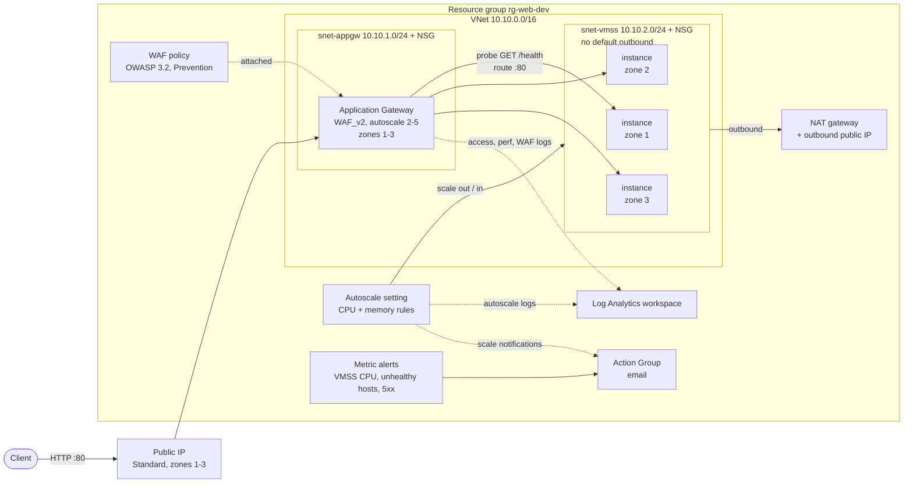
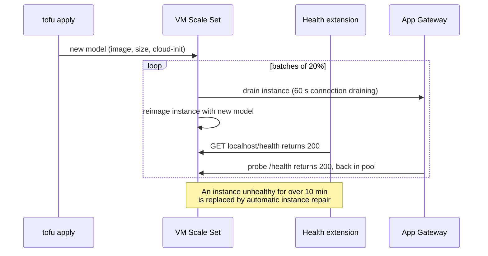

# Project 8: Application Gateway WAF in front of an autoscaling VM Scale Set

## Goal

Run a small web tier on Azure VMs the way you would in production:

- an **Application Gateway v2 with a WAF policy** (OWASP Core Rule Set, Prevention mode) as the only public entry point
- a **Linux VM Scale Set** spread over three availability zones, in a private subnet, with no public IPs
- **autoscale** on CPU and memory, with separate scale-out and scale-in rules
- **rolling upgrades** and **automatic instance repair**, both driven by the Application Health extension
- **boot diagnostics**, a **Log Analytics workspace** with diagnostic settings, and **metric alerts** sent to an **Action Group** (email)

cloud-init installs a tiny Python web server on every instance. It answers `/` with the host name and `/health` with `ok`.

## Architecture



Rolling upgrade and repair loop:



## What it creates

| File | Resources |
| --- | --- |
| `main.tf` | Resource group, VNet, `snet-appgw`, `snet-vmss`, two NSGs, NAT gateway with its public IP |
| `appgw.tf` | Public IP (zone-redundant), WAF policy, Application Gateway `WAF_v2` |
| `vmss.tf` | Linux VM Scale Set (Ubuntu 24.04, Trusted Launch), Application Health extension, rolling upgrade policy, automatic repair |
| `monitoring.tf` | Log Analytics workspace, diagnostic settings, autoscale setting, Action Group, three metric alerts |
| `scripts/server.py` | The web server (Python standard library only) |
| `scripts/cloud-init.yaml.tftpl` | cloud-init template: writes `server.py` and a hardened systemd unit |

### NSG rules

| NSG | Rule | Why |
| --- | --- | --- |
| `nsg-*-appgw` | Allow `GatewayManager` on TCP 65200-65535 | Required by App Gateway v2. Without it the gateway fails to deploy. |
| `nsg-*-appgw` | Allow `AzureLoadBalancer` | Required by App Gateway v2 |
| `nsg-*-appgw` | Allow `Internet` on TCP 80, 443 | Client traffic |
| `nsg-*-vmss` | Allow TCP 80 from the gateway subnet only | Backend traffic and probes |
| `nsg-*-vmss` | Allow `AzureLoadBalancer` | Platform health traffic |
| `nsg-*-vmss` | Deny all other inbound (priority 4000) | Blocks VNet-to-VNet traffic that the default rules allow |

### Autoscale rules

| Direction | Metric | Condition | Change | Cooldown |
| --- | --- | --- | --- | --- |
| Out | `Percentage CPU` | avg over 5 min > 70 % | +1 | 5 min |
| Out | `Available Memory Bytes` | avg over 5 min < 512 MiB | +1 | 5 min |
| In | `Percentage CPU` | avg over 10 min < 30 % | -1 | 10 min |
| In | `Available Memory Bytes` | avg over 10 min > 1.5 GiB | -1 | 10 min |

Azure scales **out** when any scale-out rule is true. It scales **in** only when **all** scale-in rules are true. All thresholds are variables.

### Alerts (all go to the Action Group)

| Alert | Metric | Fires when | Severity |
| --- | --- | --- | --- |
| `alert-*-vmss-cpu-high` | VMSS `Percentage CPU` | avg > 85 % for 5 min (autoscale is not keeping up, or is at max) | 2 |
| `alert-*-agw-unhealthy-hosts` | App Gateway `UnhealthyHostCount` | avg > 0 for 5 min | 1 |
| `alert-*-agw-5xx` | App Gateway `ResponseStatus`, `HttpStatusGroup = 5xx` | total > 10 in 5 min | 2 |

## Prerequisites

- OpenTofu 1.6+ or Terraform 1.5+ (`tofu test` with `mock_provider` needs OpenTofu 1.8+ or Terraform 1.7+)
- Azure CLI, logged in: `az login`
- **Contributor** on the subscription
- A region with availability zones (default `centralindia`) and quota for `Standard_B2s` (2-6 VMs)
- The shared state storage account `tfstatestorage759` with container `tfstate` in `test-rg` (see the root README)
- An SSH key pair: `ssh-keygen -t ed25519`

## Files

| File | What it holds |
| --- | --- |
| `providers.tf` | Version pins (`azurerm ~> 4.0`) and the provider block |
| `backend.tf` | Remote state, key `project8-appgw-waf-vmss-autoscale/terraform.tfstate` |
| `variables.tf` | All inputs, with validation |
| `main.tf`, `appgw.tf`, `vmss.tf`, `monitoring.tf` | Resources (see the table above) |
| `outputs.tf` | App URL, health URL, names, NAT outbound IP, workspace ID |
| `terraform.tfvars.example` | Example input values |
| `scripts/` | Web server and cloud-init template |
| `tests/plan.tftest.hcl` | Offline tests with a mocked `azurerm` provider |

## Usage

1. Log in and select the subscription.

   ```bash
   az login
   export ARM_SUBSCRIPTION_ID=$(az account show --query id -o tsv)
   ```

2. Create your variable file. Set at least `admin_ssh_public_key` and `alert_email`.

   ```bash
   cd project8-appgw-waf-vmss-autoscale
   cp terraform.tfvars.example terraform.tfvars
   ```

3. Init, plan and apply. The Application Gateway takes 5-10 minutes.

   ```bash
   tofu init
   tofu plan -out tfplan
   tofu apply tfplan
   ```

4. Confirm the Action Group email. Azure sends a "You have been added to an action group" mail to `alert_email`.

## How to verify

```bash
APP=$(tofu output -raw app_url)
curl -s "$APP"          # hello from web000000 (the host name changes per instance)
curl -s "${APP}health"  # ok

# WAF in Prevention mode blocks an obvious SQL injection with 403
curl -s -o /dev/null -w '%{http_code}\n' "${APP}?id=1%27%20OR%20%271%27=%271"

RG=$(tofu output -raw resource_group_name)
AGW=$(tofu output -raw application_gateway_name)
VMSS=$(tofu output -raw vmss_name)

# All backends should be Healthy
az network application-gateway show-backend-health -g "$RG" -n "$AGW" \
  --query 'backendAddressPools[].backendHttpSettingsCollection[].servers[].{ip:address,health:health}' -o table

# Instances, zones and health extension state
az vmss list-instances -g "$RG" -n "$VMSS" --query '[].{name:name,zone:zones[0],state:provisioningState}' -o table
az vmss get-instance-view -g "$RG" -n "$VMSS" --instance-id '*' \
  --query '[].{computer:computerName,health:vmHealth.status.code}' -o table
```

WAF blocks in Log Analytics (KQL, resource-specific table):

```kusto
AGWFirewallLogs
| where TimeGenerated > ago(1h)
| where Action == "Blocked"
| project TimeGenerated, ClientIp, RequestUri, RuleId, Message
| order by TimeGenerated desc
```

To see autoscale work, load the CPU on every instance for 15 minutes and watch the instance count:

```bash
for id in $(az vmss list-instances -g "$RG" -n "$VMSS" --query '[].instanceId' -o tsv); do
  az vmss run-command invoke -g "$RG" -n "$VMSS" --instance-id "$id" --command-id RunShellScript \
    --scripts 'for i in $(seq "$(nproc)"); do nohup timeout 900 sh -c "while :; do :; done" >/dev/null 2>&1 & done' --no-wait
done
watch -n 30 "az vmss list-instances -g $RG -n $VMSS --query 'length(@)'"
```

To see a rolling upgrade, change `image.version` or `vm_sku` and apply again. Watch it with `az vmss rolling-upgrade get-latest -g "$RG" -n "$VMSS"`.

## Clean up

```bash
tofu destroy
```

This deletes the resource group and everything in it, including the Log Analytics data.

## Troubleshooting

| Symptom | Cause and fix |
| --- | --- |
| App Gateway create fails with an NSG error | The gateway subnet NSG must allow `GatewayManager` on 65200-65535. It is in `main.tf`; do not remove it. |
| `502 Bad Gateway` from the gateway | Backends are unhealthy. Run `show-backend-health`. Check that cloud-init ran: boot diagnostics serial log in the portal, or `az vmss run-command invoke ... --scripts 'systemctl status webapp'`. |
| Rolling upgrade stops with "unhealthy instances exceed" | More than 20 % of instances failed `/health` after the update. Fix the image or cloud-init, then `az vmss rolling-upgrade start`. |
| `SkuNotAvailable` or zone errors on the VMSS | The size is not offered in every zone of the region. Pick another `vm_sku` or set `zones`. |
| Autoscale never scales in | Both scale-in rules must be true. Memory may be below `memory_scale_in_bytes`. Check `AutoscaleEvaluations` logs in the workspace. |
| No alert emails | The Action Group email was not confirmed, or it went to spam. Use "Test action group" in the portal. |
| `tofu plan` keeps showing a change to `instances` | It should not: `ignore_changes = [instances]` hands the count to autoscale. Check you are on this version of `vmss.tf`. |

## Tested

What was run (OpenTofu v1.12.2, azurerm 4.81.0, Linux):

| Command | Result |
| --- | --- |
| `tofu fmt -check -recursive` | OK, no changes |
| `tofu init -backend=false` | OK |
| `tofu validate` | `Success! The configuration is valid.` (no warnings) |
| `tofu test` (mocked `azurerm`) | `Success! 6 passed, 0 failed.` |
| Rendered `local.cloud_init` with `tofu console`, then `cloud-init schema -c` (cloud-init 24.4 in a `python:3.12-slim` container) | `Valid schema` |
| `systemd-analyze verify` on the rendered `webapp.service` | No errors for the unit |
| `PORT=18093 python3 scripts/server.py` and `curl` | `/` 200 with host name, `/health` 200 `ok`, other paths 404 |
| `trivy config` (aquasec/trivy 0.74.0, MEDIUM and up) | 0 misconfigurations |

The tests check: WAF Prevention mode and OWASP rule set, `WAF_v2` gateway in three zones, VMSS zones and zone balance, `Rolling` upgrade mode, automatic repair, boot diagnostics, SSH-only login, the Application Health extension, that cloud-init contains the `/health` handler, the VMSS NSG rules, the four autoscale rules (CPU and memory, two scale-in), the Action Group email and short name, the 5xx alert dimension, and input validation (WAF mode, email, instance counts, CPU thresholds that would flap). A quick mutation check (switch to `Manual` upgrade mode, rename `/health`) made the tests fail as expected.

NOT tested:

- Not deployed to Azure. That needs a subscription and `az login`. So these were not seen working: the gateway probe, real WAF blocking, scale-out under load, a rolling upgrade, instance repair, alert emails.
- `tofu plan` against Azure was not run (the provider needs a logged-in subscription).
- The `Available Memory Bytes` and `ResponseStatus` metric names follow the Azure Monitor docs; Azure only checks them at apply time.
- cloud-init was schema-checked, not booted on a real Ubuntu VM.

## Interview talking points

- **WAF policy as its own resource, Prevention by default.** The policy is separate from the gateway, so it can be shared or attached per listener later. Start new apps in `Detection` while you tune false positives (`AGWFirewallLogs`), then switch to `Prevention`. `waf_mode` is a validated variable so nobody can set it to an unknown value.
- **Health is one signal used three times.** `/health` is used by the gateway probe (routing), the Application Health extension (rolling upgrade gates) and automatic repair (replace broken VMs). Connection draining (60 s) lets in-flight requests finish when an instance leaves the pool. Trade-off: a shallow `/health` can say "healthy" while a dependency is down; a deep check can take every instance out at once.
- **Asymmetric autoscale.** Scale out fast (5 min window, 5 min cooldown, any rule) and scale in slowly (10 min, all rules). Thresholds are validated so scale-in is always below scale-out, which prevents flapping. `ignore_changes = [instances]` stops Terraform from fighting autoscale. Memory comes from the host metric `Available Memory Bytes`, so no guest agent is needed.
- **Private backends with explicit outbound.** Instances have no public IP and the subnet has `default_outbound_access_enabled = false`. A NAT gateway gives one known outbound IP, which you can allow-list at partners. The VMSS NSG denies everything except port 80 from the gateway subnet.
- **What I would add for production.** HTTPS listener with a Key Vault certificate and HTTP-to-HTTPS redirect, a custom image from Azure Compute Gallery instead of cloud-init (faster scale-out), a scheduled autoscale profile for known peaks, and alert rules in KQL for WAF blocks. TODO (Siva): add a real example from your work where autoscale or the WAF needed tuning, if you have one.
