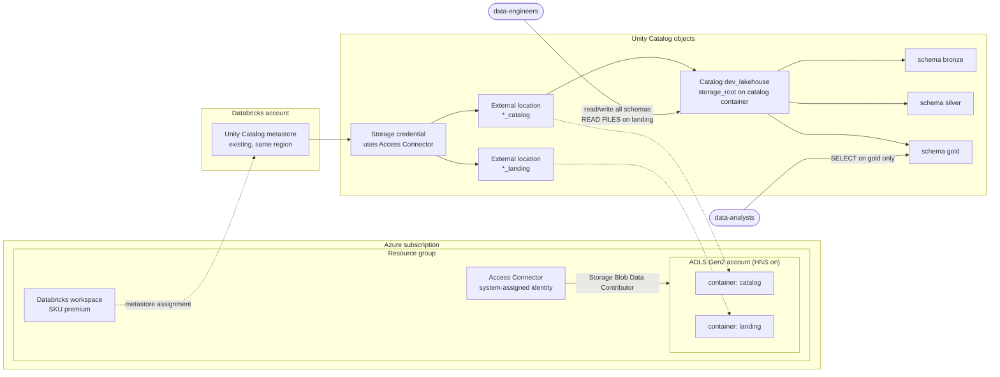

# Project 8: Azure Databricks + Unity Catalog with OpenTofu

## Goal

Build a small, governed lakehouse on Azure with one OpenTofu config:

- an Azure Databricks workspace (Premium SKU, needed for Unity Catalog)
- an ADLS Gen2 storage account with two containers (`catalog` and `landing`)
- a Databricks Access Connector (a managed identity) that is the only identity with data access to the storage
- Unity Catalog objects: metastore assignment, storage credential, external locations, a catalog with `bronze`/`silver`/`gold` schemas, and grants to groups

Users never get storage keys. Unity Catalog grants decide who can read or write.

## Architecture



## What it creates

| Resource | Purpose |
| --- | --- |
| `azurerm_resource_group.this` | Holds the workspace, storage and connector |
| `azurerm_databricks_workspace.this` | Premium workspace; the managed resource group is `<rg>-managed` |
| `azurerm_storage_account.uc` | ADLS Gen2 (`is_hns_enabled = true`), TLS 1.2, no public blobs |
| `azurerm_storage_container.uc` | `catalog` (managed tables) and `landing` (raw files) |
| `azurerm_databricks_access_connector.uc` | Managed identity that Unity Catalog uses to reach storage |
| `azurerm_role_assignment.uc_blob_contributor` | Gives the connector identity data access to the account |
| `databricks_metastore_assignment.this` | Attaches the workspace to an existing metastore (optional) |
| `databricks_storage_credential.uc` | Wraps the Access Connector identity |
| `databricks_external_location.uc` | One per container, both use the storage credential |
| `databricks_catalog.this` | Catalog with managed storage in the `catalog` container |
| `databricks_schema.layer` | `bronze`, `silver`, `gold` (from `var.schemas`) |
| `databricks_grants.*` | Catalog, schema and landing grants to two groups |

Grants that are created:

| Securable | `data-engineers` | `data-analysts` |
| --- | --- | --- |
| Catalog | `USE_CATALOG`, `BROWSE` | `USE_CATALOG`, `BROWSE` |
| Schemas `bronze`, `silver` | `USE_SCHEMA`, `SELECT`, `MODIFY`, `CREATE_TABLE`, volume privileges | none |
| Schema `gold` | same as above | `USE_SCHEMA`, `SELECT` |
| External location `*_landing` | `READ_FILES`, `CREATE_EXTERNAL_TABLE` | none |

## What needs a real subscription and account admin

| Step | Needs |
| --- | --- |
| `tofu fmt`, `tofu validate`, `tofu test` | Nothing. Runs offline with mocked providers |
| `tofu plan` | `az login` to a subscription (the azurerm provider reads the subscription) |
| Create resource group, workspace, storage, connector | Azure **Contributor** on the subscription |
| Role assignment for the connector | Azure **Owner** or **User Access Administrator** (or Role Based Access Control Administrator) |
| `databricks_metastore_assignment` | Databricks **account admin** |
| Storage credential and external locations | Metastore admin, or `CREATE STORAGE CREDENTIAL` / `CREATE EXTERNAL LOCATION` on the metastore |
| Catalog | Metastore admin, or `CREATE CATALOG` on the metastore |
| Grants to groups | The groups must exist at **account** level (Account console, or synced from Entra ID) |

You also need an existing Unity Catalog metastore in the same region. One metastore per region is normal. Many accounts already have one that was created automatically. Copy its ID from the Account console (Catalog > Metastores).

## Prerequisites

- OpenTofu 1.8 or newer (`tofu test` with `mock_provider` needs 1.8). Terraform 1.7+ also works for `validate` and `test`.
- Azure CLI, logged in: `az login`
- The roles listed in the table above
- An existing metastore ID and two account groups (default names: `data-engineers`, `data-analysts`)

## Files

| File | What it holds |
| --- | --- |
| `versions.tf` | OpenTofu version and provider pins (`azurerm ~> 4.0`, `databricks ~> 1.117`) |
| `providers.tf` | azurerm provider, and the workspace-level Databricks provider built from the new workspace |
| `backend.tf` | Empty `azurerm` backend (partial configuration) |
| `backend.hcl.example` | Example backend values. Copy to `backend.hcl` (git-ignored) |
| `variables.tf` | All names, the metastore ID, schemas and group names |
| `main.tf` | Azure resources, metastore assignment, credential, external locations, catalog, schemas |
| `grants.tf` | `databricks_grants` for catalog, schemas and the landing location |
| `outputs.tf` | Workspace URL, IDs, external locations, schema names |
| `terraform.tfvars.example` | Example input values |
| `tests/plan.tftest.hcl` | Offline tests with mocked providers |

## Usage

1. Log in and pick the subscription.

   ```bash
   az login
   export ARM_SUBSCRIPTION_ID=$(az account show --query id -o tsv)
   ```

2. Create the state storage once (skip if you already have one), then set up the backend file.

   ```bash
   cp backend.hcl.example backend.hcl
   # edit backend.hcl: resource group, storage account, container, key
   ```

3. Create your variable file.

   ```bash
   cp terraform.tfvars.example terraform.tfvars
   # edit: storage_account_name (globally unique), metastore_id, group names
   ```

4. Init, plan and apply.

   ```bash
   tofu init -backend-config=backend.hcl
   tofu plan -out tfplan
   tofu apply tfplan
   ```

5. If the account already attached the workspace to the regional metastore, either set `assign_metastore = false`, or import the existing assignment:

   ```bash
   tofu import 'databricks_metastore_assignment.this[0]' '<workspace_id>|<metastore_id>'
   ```

## How to verify

```bash
tofu output workspace_url
tofu output schemas
```

Then, in a SQL editor or notebook in the workspace:

```sql
SHOW SCHEMAS IN dev_lakehouse;
SHOW GRANTS ON CATALOG dev_lakehouse;
SHOW GRANTS ON SCHEMA dev_lakehouse.gold;
DESCRIBE EXTERNAL LOCATION dev_lakehouse_landing;

-- Managed table lands in the catalog container
CREATE TABLE dev_lakehouse.bronze.smoke_test (id INT);
DESCRIBE DETAIL dev_lakehouse.bronze.smoke_test;
DROP TABLE dev_lakehouse.bronze.smoke_test;
```

## Clean up

```bash
tofu destroy
```

- The catalog is not dropped while it still has tables. Drop them first, or set `catalog_force_destroy = true` for a lab.
- If `assign_metastore = true`, destroy also removes the metastore assignment from the workspace. The metastore itself is not touched.
- The storage account and its data are deleted. Do not run destroy against a workspace with real data.

## Troubleshooting

| Symptom | Cause and fix |
| --- | --- |
| External location create fails with `403` / `PERMISSION_DENIED` on the storage path | The role assignment for the connector can take a few minutes to propagate. Wait and run `tofu apply` again. |
| `Workspace ... already has a metastore assigned` | The account auto-assigned the workspace. Set `assign_metastore = false` or import the assignment (step 5). |
| Databricks provider error about a missing `host` on the first apply | Create the workspace first: `tofu apply -target=azurerm_databricks_workspace.this`, then a normal `tofu apply`. |
| `Could not find principal with name data-engineers` | The group does not exist at account level, or is not synced from Entra ID. Create or sync it, or change the variable. |
| `User does not have CREATE STORAGE CREDENTIAL on Metastore` | Run as a metastore admin, or ask one to grant that privilege. |
| `storage_root` / `LOCATION_OVERLAP` errors | The catalog root must be inside the `*_catalog` external location and external locations must not overlap. Keep one container per location. |

## Tested

What was run (OpenTofu v1.12.2, azurerm 4.81.0, databricks 1.117.0, on Linux):

| Command | Result |
| --- | --- |
| `tofu fmt -check -recursive` | OK, no changes |
| `tofu init -backend=false` | OK |
| `tofu validate` | `Success! The configuration is valid.` |
| `tofu test` (mocked `azurerm` and `databricks`) | `Success! 4 passed, 0 failed.` |

The tests check: Premium SKU, HNS on, metastore assignment on/off, the `abfss://` URLs of the external locations, the catalog `storage_root`, the three schema names, which schemas the analysts group gets, and the input validation for the storage account name and metastore ID.

NOT tested:

- Not deployed to Azure. That needs a subscription, `az login` and the roles above.
- Not run against a Databricks account. Metastore assignment, storage credential validation and grants need a real account and an account admin.
- `tofu plan` was not run, because the azurerm provider needs a logged-in subscription even for a plan.

## Interview talking points

- **Access Connector instead of service principal secrets.** The storage credential uses a managed identity, so there is no secret to rotate. Only that identity has `Storage Blob Data Contributor`. People get access through Unity Catalog grants, which are audited in `system.access.audit`.
- **Existing metastore as an input.** A metastore is one per region and owned at account level, so this config does not create it. It only assigns the workspace, and `assign_metastore = false` covers accounts that auto-assign. This keeps the blast radius of a workspace stack small.
- **One container per external location, catalog-level managed storage.** The catalog `storage_root` sits in its own container, so each environment's managed tables can live in their own account. The landing container is separate and only engineers get `READ_FILES` on it.
- **Authoritative `databricks_grants`.** Each securable has one grants resource that owns the full list, so a manual `GRANT` in the UI is reverted on the next apply. That is drift control, but it means all grants for that object must live in code. Grants go to groups, never to single users.
- **Trade-offs left out on purpose.** No VNet injection, private endpoints, or customer-managed keys, and shared key access on the storage account is still on. For production: VNet-injected workspace with secure cluster connectivity, private endpoints for `dfs`, `shared_access_key_enabled = false`, and an `ISOLATED` catalog bound to the workspace.

## Lock file

No `.terraform.lock.hcl` is committed. Run `tofu init` once and commit the lock file in your own fork if you want pinned provider hashes. To add hashes for other platforms:

```bash
tofu providers lock -platform=linux_amd64 -platform=darwin_arm64 -platform=windows_amd64
```
