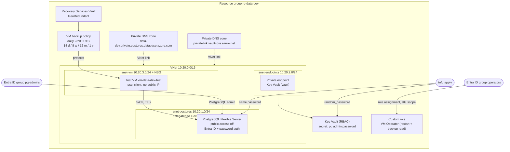

# Project 9: Private PostgreSQL, Azure Backup and a custom RBAC role

## Goal

Build the data and operations layer of an app on Azure, with no public endpoints and no passwords in code:

- **Azure Database for PostgreSQL Flexible Server** with private access: a delegated subnet and a private DNS zone linked to the VNet
- **Entra ID authentication** with a group as PostgreSQL admin. The local admin password is a break-glass account: generated with `random_password` and stored in **Key Vault**
- **Key Vault** in RBAC mode, reachable through a **private endpoint** (public access off by default)
- **Backups**: point-in-time restore retention, optional geo-redundant backup, and selected **server parameters**
- A **Recovery Services Vault** with a **daily VM backup policy** (daily, weekly, monthly, yearly retention) protecting a small test VM
- A **custom RBAC role** (read and restart VMs, read backups, nothing else) assigned to an Entra ID group

## Architecture



## What it creates

| File | Resources |
| --- | --- |
| `network.tf` | Resource group, VNet, three subnets (one delegated), two NSGs, two private DNS zones with VNet links |
| `postgres.tf` | `random_password`, Flexible Server, Entra ID admin, server parameters, database `appdb` |
| `keyvault.tf` | Key Vault (RBAC, firewall), private endpoint with DNS zone group, `Key Vault Secrets Officer` for the deployer, password secret |
| `backup.tf` | Test VM (Ubuntu 24.04, SSH key only, boot diagnostics), Recovery Services Vault, VM backup policy, protected VM |
| `rbac.tf` | Custom role definition and its assignment to the operators group |

### Custom role: what the operators group can do

| Allowed action | Why |
| --- | --- |
| `Microsoft.Resources/subscriptions/resourceGroups/read` | See the resource group |
| `Microsoft.Compute/virtualMachines/read`, `.../instanceView/read` | See VMs and their power state |
| `Microsoft.Compute/virtualMachines/restart/action` | Restart a hung VM |
| `Microsoft.Network/networkInterfaces/read` | See the VM's IP in the portal |
| `Microsoft.RecoveryServices/Vaults/read`, `backupPolicies/read`, `backupProtectedItems/read`, `backupJobs/read`, `protectedItems/read`, `recoveryPoints/read` | Check that backups run and which recovery points exist |

Not allowed: start/stop/deallocate, delete, write, run command, restore, or any data action. The role can only be assigned inside this resource group (`assignable_scopes`).

### Server parameters (default `server_parameters`)

| Parameter | Value | Why |
| --- | --- | --- |
| `require_secure_transport` | `on` | TLS only |
| `log_min_duration_statement` | `1000` | Log queries slower than 1 s |
| `idle_in_transaction_session_timeout` | `600000` | Kill sessions idle in a transaction for 10 min (they hold locks) |
| `azure.extensions` | `PG_STAT_STATEMENTS,PGCRYPTO` | Allow-list extensions for `CREATE EXTENSION` |

## Prerequisites

- OpenTofu 1.6+ or Terraform 1.5+ (`tofu test` with `mock_provider` needs OpenTofu 1.8+ or Terraform 1.7+)
- Azure CLI, logged in: `az login`
- **Owner**, or **Contributor** + **User Access Administrator** on the subscription. Creating a custom role and role assignments needs `Microsoft.Authorization/roleDefinitions/write` and `roleAssignments/write`
- Two Entra ID groups, for example `pg-admins` and `vm-operators`. Get their object IDs:

  ```bash
  az ad group show -g pg-admins --query id -o tsv
  az ad group show -g vm-operators --query id -o tsv
  ```

- Network access to Key Vault for the secret write: either your public IP in `key_vault_allowed_ips`, or run Terraform from inside the VNet (self-hosted agent)
- The shared state storage account `tfstatestorage759` with container `tfstate` in `test-rg` (see the root README)
- An SSH key pair for the test VM: `ssh-keygen -t ed25519`

## Files

| File | What it holds |
| --- | --- |
| `providers.tf` | Version pins (`azurerm ~> 4.0`, `random ~> 3.6`) and the provider block |
| `backend.tf` | Remote state, key `project9-postgresql-private-backup-rbac/terraform.tfstate` |
| `variables.tf` | All inputs, with validation |
| `network.tf`, `postgres.tf`, `keyvault.tf`, `backup.tf`, `rbac.tf` | Resources (see the table above) |
| `outputs.tf` | Server FQDN, Key Vault and secret names, `psql` command, vault and policy, role ID |
| `terraform.tfvars.example` | Example input values |
| `tests/plan.tftest.hcl` | Offline tests with a mocked `azurerm` provider |

## Usage

1. Log in and select the subscription.

   ```bash
   az login
   export ARM_SUBSCRIPTION_ID=$(az account show --query id -o tsv)
   ```

2. Create your variable file. Fill in the group object IDs, the admin group name, your SSH public key and your public IP.

   ```bash
   cd project9-postgresql-private-backup-rbac
   cp terraform.tfvars.example terraform.tfvars
   curl -s https://ifconfig.me   # your public IP for key_vault_allowed_ips
   ```

3. Init, plan and apply. The server takes about 10 minutes.

   ```bash
   tofu init
   tofu plan -out tfplan
   tofu apply tfplan
   ```

4. Optional: remove your IP from `key_vault_allowed_ips` and apply again, so Key Vault is private only.

## How to verify

The server has no public endpoint, so test from the VM inside the VNet. Use Azure Bastion or `az vm run-command`:

```bash
RG=$(tofu output -raw resource_group_name)
VM=$(tofu output -raw test_vm_name)
FQDN=$(tofu output -raw postgres_fqdn)

# DNS resolves to a private 10.20.1.x address inside the VNet
az vm run-command invoke -g "$RG" -n "$VM" --command-id RunShellScript \
  --scripts "getent hosts $FQDN; pg_isready -h $FQDN -p 5432"

# From your laptop the name does not resolve to anything reachable
nslookup "$FQDN"
```

Break-glass login with the password from Key Vault. Run it on a machine inside the VNet that has `psql` and the Azure CLI, for example the test VM over Azure Bastion after `curl -sL https://aka.ms/InstallAzureCLIDeb | sudo bash` and `az login`:

```bash
KV=$(tofu output -raw key_vault_name)
SECRET=$(tofu output -raw admin_password_secret_name)
PGPASSWORD=$(az keyvault secret show --vault-name "$KV" -n "$SECRET" --query value -o tsv) \
  psql "host=$FQDN dbname=appdb user=pgadmin sslmode=require" -c 'select version();'
```

Entra ID login for a member of the admin group: run the command from `tofu output -raw psql_entra_command` on the VM.

Server settings, backups and the role:

```bash
SERVER=$(tofu output -raw postgres_server_name)
az postgres flexible-server show -g "$RG" -n "$SERVER" \
  --query '{public:network.publicNetworkAccess,backupDays:backup.backupRetentionDays,geo:backup.geoRedundantBackup}'
az postgres flexible-server parameter show -g "$RG" -s "$SERVER" -n require_secure_transport --query value

VAULT=$(tofu output -raw recovery_vault_name)
az backup item list -g "$RG" -v "$VAULT" -o table
az backup protection backup-now -g "$RG" -v "$VAULT" -c "$VM" -i "$VM" --backup-management-type AzureIaasVM
az backup job list -g "$RG" -v "$VAULT" -o table

az role definition list --custom-role-only true --scope "$(az group show -n "$RG" --query id -o tsv)" -o table
```

To test the role, sign in as a member of the operators group: restarting the VM works, stopping or deleting it fails with `AuthorizationFailed`.

## Clean up

```bash
tofu destroy
```

- Azure Backup soft delete keeps the VM backup data for 14 more days. Destroy can fail on the vault with "vault cannot be deleted as there are existing resources". For a lab: in the vault, stop protection with "delete backup data", disable soft delete, delete the soft-deleted item, then run `tofu destroy` again.
- Key Vault is soft-deleted on destroy. Without purge protection the provider purges it right away. With `key_vault_purge_protection = true` it cannot be purged, and the name stays reserved for 7 days.

## Troubleshooting

| Symptom | Cause and fix |
| --- | --- |
| `403 Forbidden` / `ForbiddenByFirewall` when creating the Key Vault secret | Your IP is not in `key_vault_allowed_ips`, or you run outside the VNet with an empty list. Add your IP or run from inside the VNet. A new role assignment can also take a few minutes; run apply again. |
| Server create fails with a private DNS zone error | The zone must end in `.postgres.database.azure.com` and be linked to the VNet first. The `depends_on` on the link handles this; do not remove it. |
| `SubnetIsNotDelegated` or `subnet is in use` | Only Flexible Servers may use `snet-postgres`. Do not put the VM or endpoints there. |
| `geo_redundant_backup_enabled` plan shows "forces replacement" | Geo-redundant backup can only be chosen at create time. Restore into a new server instead. |
| Entra ID login fails with `password authentication failed` | The token is the password; it expires after about an hour. The user must be a member of the admin group, and `user=` must be the group name. |
| `RoleDefinitionWithSameNameExists` | Custom role names are unique per tenant. Change `prefix`. |
| VM backup stays in `Initial backup pending` | The first backup runs at the policy time. Use `backup-now` above. The VM needs outbound access to Azure Backup. |

## Tested

What was run (OpenTofu v1.12.2, azurerm 4.81.0, random 3.9.1, Linux):

| Command | Result |
| --- | --- |
| `tofu fmt -check -recursive` | OK, no changes |
| `tofu init -backend=false` | OK |
| `tofu validate` | `Success! The configuration is valid.` (no warnings) |
| `tofu test` (mocked `azurerm`, real `random`) | `Success! 7 passed, 0 failed.` |
| `trivy config` (aquasec/trivy 0.74.0, MEDIUM and up) | 5 MEDIUM findings, all reviewed (see below) |

The tests check: no public access on the server, delegated subnet and private DNS zone, Entra ID auth and the group admin, backup retention and geo-redundant backup flags, `require_secure_transport`, that the generated password is in Key Vault and used by the server, Key Vault private by default and opened only for listed IPs, the private endpoint sub-resource, the daily backup policy and its retention tiers (yearly can be turned off), that the test VM is protected, that the custom role has restart but no wildcard, write or delete actions and is scoped to the resource group, the group assignment, and input validation (retention > 35, non-GUID group, reserved admin login, cross-region restore without GRS). A mutation check (public access on, a `virtualMachines/*` action) made the tests fail as expected.

Trivy findings that were accepted:

- `AZU-0068` NIC without NSG: the NSG is on the subnet, which covers the NIC.
- `AZU-0016` Key Vault purge protection: off by default so the lab can be destroyed. Set `key_vault_purge_protection = true` for production.
- `AZU-0019`, `AZU-0021`, `AZU-0024` (log connections, connection throttling, log checkpoints): add them to `server_parameters` if your policy needs them. They were not added because they were not checked against a live Flexible Server.

NOT tested:

- Not deployed to Azure. That needs a subscription, two Entra ID groups and rights to create role definitions. So private DNS resolution, Entra ID login, the backup job and the custom role were not seen working.
- `tofu plan` against Azure was not run (the provider needs a logged-in subscription).
- The custom role action names follow the built-in `Backup Reader` and `Virtual Machine Contributor` roles; Azure checks them only at apply time.

## Interview talking points

- **Private access (VNet integration) vs private endpoint for PostgreSQL.** VNet integration puts the server in a delegated subnet and needs a private DNS zone; it is simple and has no public endpoint at all. The trade-off: you choose it at create time and cannot switch to public later. Private endpoint mode is newer and fits hub-and-spoke designs with central DNS. Key Vault uses a private endpoint here, so both patterns are shown.
- **Entra ID first, password only for break-glass.** People log in with their Entra ID group membership and short-lived tokens, so leaving the team removes access. The local admin password is random, never in code, and stored in Key Vault. It is still in the Terraform state, so the state must be protected (encrypted storage, RBAC). The provider's write-only `administrator_password_wo` argument can keep it out of state.
- **Two backup layers.** Flexible Server has its own point-in-time restore (7-35 days, optional geo-redundant copy, chosen at create time). VMs use a Recovery Services Vault with grandfather-father-son retention (14 daily, 8 weekly, 12 monthly, 1 yearly). Retention costs storage, so tiers keep long history cheap. Soft delete protects against ransomware but makes lab clean-up slower.
- **Least-privilege custom role.** Built-in roles like `Virtual Machine Contributor` allow delete and run-command. The custom role lists exact actions, no wildcards, and can only be assigned in one resource group. It is assigned to a group, never to users. A test fails if someone adds `*`, `write` or `delete`.
- **What I would add for production.** Zone-redundant high availability for the server, diagnostic settings to Log Analytics (PostgreSQL logs, Key Vault audit events), purge protection, Azure Policy to deny public network access on databases, and a regular restore test. TODO (Siva): mention a real restore or access-review story from your work, if you have one.
